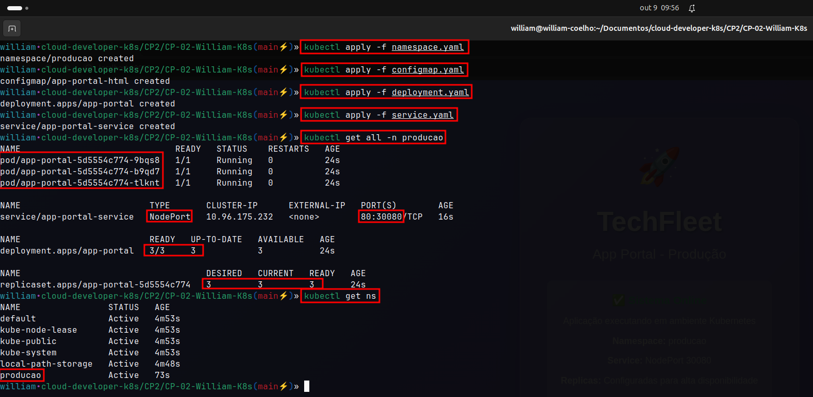
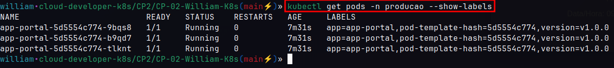
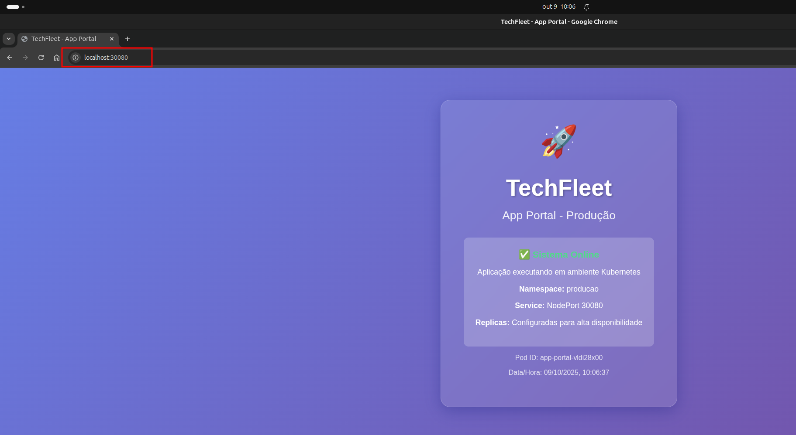
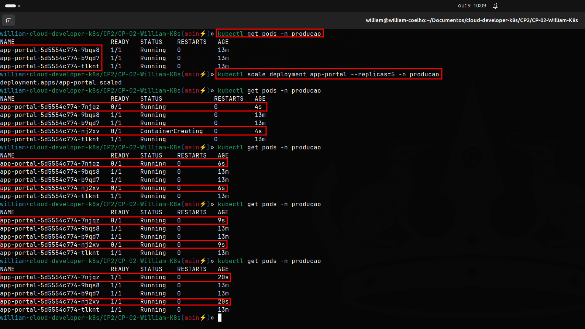
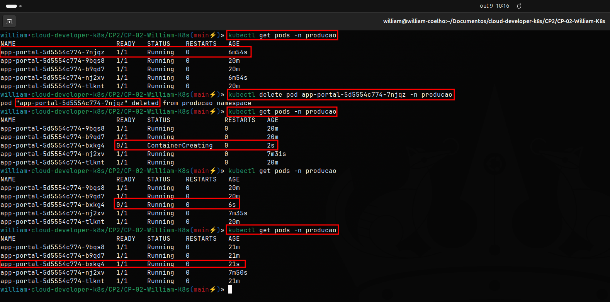

# 🚀 TechFleet - App Portal Kubernetes

**Desenvolvido por:** William Coelho  
**RM:** 556336  
**Projeto:** CP-02 - Kubernetes TechFleet  

## 📋 Cenário do Projeto

**Empresa:** TechFleet  
**Objetivo:** Migração de aplicações para containers orquestrados em Kubernetes  
**Desafio:** Configurar ambiente de produção simulado com alta disponibilidade, escalabilidade e resiliência

---

## 🎯 Requisitos Técnicos Implementados

| Requisito | Especificação | Status |
|-----------|---------------|--------|
| **Cluster** | Kubernetes local (Kind/Minikube/AWS) | ✅ |
| **Namespace** | `producao` | ✅ |
| **Imagem** | `nginx:latest` | ✅ |
| **Deployment** | `app-portal` / 3 réplicas / label `app: app-portal` | ✅ |
| **Service** | NodePort, porta externa 30080, porta interna 80 | ✅ |
| **Escalabilidade** | Escalar para 5 réplicas | ✅ |
| **Resiliência** | Simular exclusão de Pod e observar recuperação | ✅ |
| **Customização** | Mensagem personalizada no index.html | ✅ |

---

## 📁 Estrutura do Projeto

```
CP-02-William-K8s/
├── docs/                             # Pasta para prints/evidências
│   ├── 01-cluster-info.png           # Cluster Kind funcionando
│   ├── comandos.png                  # Comandos e recursos aplicados
│   ├── labels.png                    # Labels dos pods
│   ├── nodeport.png                  # Aplicação funcionando via NodePort
│   ├── scaling.png                   # Teste de escalabilidade (3→5 réplicas)
│   ├── deletepod.png                 # Teste de resiliência/exclusão de pod
│   ├── 10-aplicacao-funcionando.png  # Aplicação via port-forward
│   └── 11-aplicacao-funcionando.png  # Evidência adicional port-forward
├── namespace.yaml                    # Definição do namespace producao
├── configmap.yaml                    # HTML customizado para a aplicação
├── deployment.yaml                   # Deployment com 3 réplicas
├── service.yaml                      # Service NodePort na porta 30080
├── kind-config.yaml                  # Configuração do cluster Kind
└── README.md                         # Esta documentação completa
```

---

## 🚀 Guia de Execução Passo a Passo

### **🔴 ETAPA 0: CONFIGURAR CLUSTER KIND (EXECUTE PRIMEIRO!)**

**ANTES DE TUDO:** Configure um cluster Kubernetes local com Kind:

#### **Instalar Kind (se não tiver):**

**Baixar Kind:**
```bash
curl -Lo ./kind https://kind.sigs.k8s.io/dl/v0.20.0/kind-linux-amd64
```

**Tornar executável:**
```bash
chmod +x ./kind
```

**Mover para PATH:**
```bash
sudo mv ./kind /usr/local/bin/kind
```

**Verificar instalação:**
```bash
kind version
```

#### **Criar cluster:**

**Criar cluster Kind:**
```bash
kind create cluster --name techfleet-cluster --config kind-config.yaml
```

**Configurar contexto:**
```bash
kubectl config use-context kind-techfleet-cluster
```

**Verificar se funcionou:**
```bash
kubectl cluster-info
```

**📸 EVIDÊNCIA:** `kubectl cluster-info`


### **Etapa 1: Criar o Namespace**

**Aplicar o namespace:**
```bash
kubectl apply -f namespace.yaml
```

**Verificar se foi criado:**
```bash
kubectl get ns
```

### **Etapa 2: Aplicar o ConfigMap (HTML Customizado)**

**Aplicar o ConfigMap:**
```bash
kubectl apply -f configmap.yaml
```

**Verificar se foi criado:**
```bash
kubectl get configmap -n producao
```


### **Etapa 3: Criar o Deployment (3 Réplicas)**

**Aplicar o Deployment:**
```bash
kubectl apply -f deployment.yaml
```

**Verificar o status do deployment:**
```bash
kubectl get deployment -n producao
```


### **Etapa 4: Criar o Service NodePort**

**Aplicar o Service:**
```bash
kubectl apply -f service.yaml
```

**Verificar o service:**
```bash
kubectl get svc -n producao
```

### **Etapa 5: Verificar Status Geral**

**Ver todos os recursos no namespace producao:**
```bash
kubectl get all -n producao
```

**📸 EVIDÊNCIA:** 



**Ver labels dos pods:**
```bash
kubectl get pods -n producao --show-labels
```




### **Etapa 6: Testar Conectividade**


**Método 1: NodePort:**


**📸 EVIDÊNCIA:**



---


**Método 2: Port-forward:**
```bash
kubectl port-forward svc/app-portal-service 8080:80 -n producao
```

**📸 EVIDÊNCIA (Opcional):**


**📸 EVIDÊNCIA ADICIONAL:**


**💡 Dica:** Use Ctrl+C para parar o port-forward

---

### **Etapa 7: Teste de Escalabilidade (3 → 5 réplicas)**

**Estado inicial (3 réplicas):**
```bash
kubectl get pods -n producao
```

**Escalar para 5 réplicas:**
```bash
kubectl scale deployment app-portal --replicas=5 -n producao
```

**Verificar o processo de scaling:**
```bash
kubectl get pods -n producao
```

**📸 EVIDÊNCIA:**



### **Etapa 8: Teste de Resiliência (Exclusão de Pod)**

**Ver pods atuais:**
```bash
kubectl get pods -n producao
```

**Pegar o nome de um pod e deletar:**
```bash
kubectl delete pod NOME-DO-POD -n producao
```

**Observar a recuperação automática:**
```bash
kubectl get pods -n producao
```

**📸 EVIDÊNCIA:**




**Para remover tudo (quando terminar os testes):**
```bash
kubectl delete -f .
```

**Deletar cluster Kind:**
```bash
kind delete cluster --name techfleet-cluster
```

**Desenvolvido por:** William  
**Projeto:** CP-02 - Kubernetes TechFleet  
**Data:** Outubro 2025